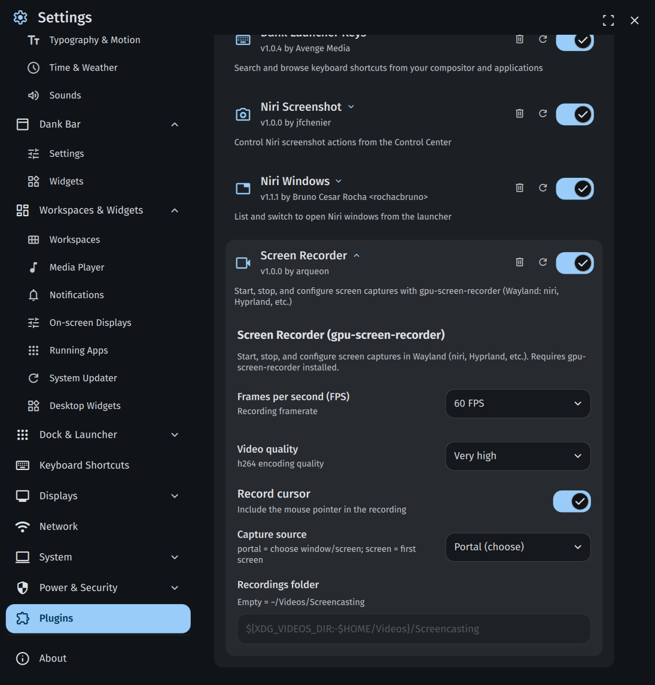

# Screen Recorder — Dank Material Shell Plugin

Plugin for **Dank Material Shell (DMS)** that wraps `gpu-screen-recorder` in a QML UI, letting you start, pause, and stop screen recordings directly from the DankBar on Wayland.



## Requirements

- [Dank Material Shell](https://github.com/AvengeMedia/DankMaterialShell) >= 1.2.0
- [gpu-screen-recorder](https://git.dec05eba.com/gpu-screen-recorder/) installed and in your `PATH`
- A working XDG Desktop Portal for screencasting (required when **Capture source** is set to `portal`)

> **Note:** The [Flatpak version of gpu-screen-recorder](https://flathub.org/en/apps/com.dec05eba.gpu_screen_recorder) is a bundled GUI frontend and is **not supported**. Install the native system package instead.

### Installing gpu-screen-recorder

#### Arch Linux & derivatives
```bash
sudo pacman -S gpu-screen-recorder
```

#### Other distros
See the [official installation guide](https://git.dec05eba.com/gpu-screen-recorder/about).

### XDG Desktop Portal (for portal capture mode)

If screen recording fails with a portal error (common on niri), install and configure a portal backend:

```bash
# Arch
sudo pacman -S xdg-desktop-portal-gnome
```

Create or edit `~/.config/xdg-desktop-portal/portals.conf`:

```ini
[preferred]
default=gnome;gtk
```

Then restart the portal services:

```bash
systemctl --user restart xdg-desktop-portal xdg-desktop-portal-gnome
```

## Installation

```bash
# Clone
git clone https://github.com/arqueon/dms-screen-recorder
ln -sf "$(pwd)/dms-screen-recorder" ~/.config/DankMaterialShell/plugins/screenRecorder

# Reload
dms ipc call plugins reload screenRecorder
```

Then go to **DMS Settings → Plugins** and enable the plugin on the bar.

## Usage

### DankBar controls

| Action | Result |
|--------|--------|
| Left click | Start recording |
| Left click (while recording) | Show **Stop?** confirmation — click again to stop and save |
| Right click or Middle click | Pause / Resume |

When you click to stop, the pill turns orange and shows **Stop?** for 3 seconds. Click again to confirm, or do nothing to cancel and keep recording. This prevents accidentally stopping a recording with a misclick.

### IPC commands (keybinds)

The plugin exposes IPC commands you can bind to keyboard shortcuts:

```bash
dms ipc call screenRecorder toggleRecording   # start or stop
dms ipc call screenRecorder startRecording
dms ipc call screenRecorder stopRecording
dms ipc call screenRecorder togglePause       # pause or resume
```

**niri** (`~/.config/niri/config.kdl`):
```kdl
bindings {
    Mod+Alt+R { spawn "dms" "ipc" "call" "screenRecorder" "toggleRecording"; }
}
```

**Hyprland** (`hyprland.conf`):
```conf
bind = SUPER ALT, R, exec, dms ipc call screenRecorder toggleRecording
```

## Configuration

Open **DMS Settings → Plugins → Screen Recorder**:

| Option | Description | Default |
|--------|-------------|---------|
| **Frames per second** | Recording framerate | 60 |
| **Video quality** | h264 encoding preset | Very high |
| **Record audio** | Capture system audio output | On |
| **Record cursor** | Include mouse pointer | On |
| **Capture source** | `portal` = choose window/screen on start; `screen` = first monitor | portal |
| **Recordings folder** | Output directory (empty = `~/Videos/Screencasting`) | — |

## How stopping works

The plugin sends `SIGINT` to `gpu-screen-recorder` so it finalises and saves the MP4 correctly, followed by `SIGKILL` to close any lingering portal window. Do not force-kill the process with `SIGKILL` directly or the file will be incomplete.

## Development

```bash
ln -sf "$(pwd)" ~/.config/DankMaterialShell/plugins/screenRecorder
dms ipc call plugins reload screenRecorder
dms ipc call plugins list
```

## License

MIT
